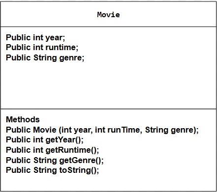

# Unit 4 - Abstract Art Project

## Introduction

Data visualizations are powerful tools to present information and convey patterns and relationships. Sometimes visualizations are charts or graphs, and other times they are more abstract pieces of art. Your goal is to create a visual representation relating at least two categories from your dataset that engages your viewer and encourages them to learn more about your chosen topic.

## Requirements

Use your knowledge of object-oriented programming, one-dimensional (1D) arrays, and algorithms to create your data visualization program:

- **Create at least two 1D arrays** – Create at least two 1D arrays to store the data that will make up your visualization.
- **Implement one or more algorithms** – Implement one or more algorithms that use two-way or multi-selection statements with compound Boolean expressions to analyze the data.
- **Use methods in the Math class** – Use one or more methods in the Math class in your program, such as to perform calculations on the values in your dataset and display the results, choose random values from the dataset, or display images or shapes at random locations.
- **Create a visualization** – Create an image or animation that conveys the story of the data by illustrating the patterns or relationships in the data.
  Note: This may be abstract! Others do not necessarily need to know what the story or pattern is right away, but you do need to be able to explain it to them.
- **Document your code** – Use comments to explain the purpose of the methods and code segments and note any preconditions and postconditions.

## Dataset

Include a hyperlink to the source of your dataset used for this project. Additionally, provide a short description of each column used from the dataset, and the data type.

 [Top 1000 IMDB dataset](https://www.kaggle.com/datasets/fernandogarciah24/top-1000-imdb-dataset?select=imdb_top_1000.csv)

- **runTime** (int) - length of the film in minutes
- **year** (int) - year the film was released
- **genre** (String) - The type of genre of the film

## UML Diagram

Put and image of your UML Diagram here. Upload the image of your UML Diagram to your repository, then use the Markdown syntax to insert your image here. Make sure your image file name is one work, otherwise it might not properly get display on this README.

## Video Demo

Record a short video of your abstract art animation to display here on your README. You can do this by:

- Screen record your project running on Code.org.
- Upload that recording to YouTube.
- Take a thumbnail for your image.
- Upload the thumbnail image to your repo.
- Use the following markdown

### Description

In our project, we used a dataset from Kaggle.com called the Top 1000 IMDB Movies Dataset. This dataset contains information about movies such as their titles, runtimes, genres, and release years. Using this data, our code plays a scene that consists of three screens designed to provide meaningful insights into the dataset:

**The first screen** displays a breakdown of the most common genres of movies from the Top 100 IMDB movies for a specific year. This is achieved by analyzing the dataset and showcasing a bar chart with colorful visuals to highlight trends.

****The second screen**** presents the total number of movies in a specific genre across all years in the dataset. These totals are visualized using colorful ellipses to represent counts.

**The third screen** announces the movie with the longest runtime in the dataset. This includes displaying the title along with sound effects and animations for added engagement.

### Features

- **Dataset**: We used key attributes from the dataset, including movie names, runtime, genre, and release year, to build the scenes.  
- **Visualization**: The project uses the Theater class to create dynamic animations, including charts and graphics, that visually convey insights in an intuitive way.  
- **Data Analysis**: Custom methods such as countGenreByYear` and countGenreTotal process the dataset to extract insights about genres for a given year and overall totals.  
- **Dynamic Feedback**: Sound effects (e.g., "dun-dun-dun.wav") and animations enhance the experience, making the visualizations interactive and fun.  

### Programming Vocabulary

- **1D Arrays**: Used to store data for movie attributes like titles, runtimes, years, and genres.  
- **Iteration**: Loops are used to process the data, such as counting genres or finding the longest runtime.  
- **Methods**: Functions like `countGenreByYear` and `longestRuntime` make the program modular and easy to maintain.  
- **Static Methods**: The `createMovies` method demonstrates how static methods can generate reusable objects.  
- **Encapsulation**: The `Movie` class encapsulates attributes like title, year, runtime, and genre, ensuring the data is neatly packaged.  
- **Inheritance**: The `DataScene` class extends the `Scene` class, showcasing how inheritance is used to create custom behaviors for specific tasks.  
- **Graphics and Animations**: Functions like `drawRectangle`, `drawText`, and `playSound` add an engaging visual and auditory experience.